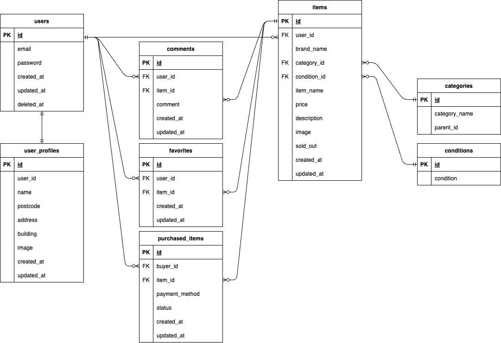

# COACHTECHフリマ


## 作成した目的
シンプルなフリーマーケットアプリ。勉強中のフレームワーク（Laravel）のアウトプットです。

## 機能一覧
### 一般ユーザ
- 会員登録・ログイン：新規ユーザの登録とログイン
- 商品出品：ブランド名・ジャンル・商品状態などを登録可能。商品単価は300円以上
- 商品検索：商品名から検索が可能
- お気に入り機能：商品をお気に入りに追加・管理
- コメント機能：商品に対してのコメント追加・自分のコメントの削除
- プロフィール編集：ユーザ名、アイコンと、住所を変更できます。
### 管理ユーザ
- ユーザの削除：一般ユーザの削除
- コメント削除：一般ユーザのコメント削除
- メール送信：一般ユーザへメールを送信

## 環境構築
**Dockerビルド**
1. `git clone git@github.com:hstonewell/mock_third.git`
2. DockerDesktopアプリを立ち上げる
3. `docker compose up -d --build`

**Laravel環境構築**
1. `docker compose exec php bash`
2. `composer install`
3. 「.env.example」ファイルを 「.env」ファイルに命名を変更。または、新しく.envファイルを作成
4. .envに以下の環境変数を追加
``` text
DB_CONNECTION=mysql
DB_HOST=mysql
DB_PORT=3306
DB_DATABASE=laravel_db
DB_USERNAME=laravel_user
DB_PASSWORD=laravel_pass
```

5. アプリケーションキーの作成
``` bash
php artisan key:generate
```

6. マイグレーションの実行
``` bash
php artisan migrate
```

7. シーディングの実行
``` bash
php artisan db:seed
```

8. シンボリックリンクの作成
``` bash
php artisan storage:link
```

**Stripeのセットアップ**
1. Stripeのダッシュボードより、テスト用の公開キーとシークレットキーを取得
- https://dashboard.stripe.com/dashboard
2. .envに以下の環境変数を追加
``` text
STRIPE_KEY=your_stripe_key
STRIPE_SECRET=your_stripe_secret_key
```

**Stripe Webhookのセットアップ**
1. Stripe CLIのインストール
``` bash
brew install stripe/stripe-cli/stripe
```

2. 下記を実行し、指示に従ってアクセス許可を行う
``` bash
stripe login
```

3. Webhookのエンドポイントを設定
``` bash
stripe listen --forward-to http://localhost/webhook/stripe
```

4. シークレットキーが発行される
``` text
> Ready! You are using Stripe API Version [2024-10-28.acacia]. Your webhook signing secret is whsec_your_webhook_secret
```

5. .envファイルに環境変数を追加
``` text
STRIPE_WEBHOOK_SECRET=your_webhook_secret
```

**テスト環境のセットアップ**
1. MySQLにrootユーザーとしてログインし、テスト用のデータベースを作成する
``` bash
CREATE DATABASE frema_test;
```
2. .envファイルをコピーし、.env.testingを作成。必要な環境変数を追加
``` text
APP_ENV=test
APP_KEY=
```
``` text
DB_DATABASE=frema_test
DB_USERNAME=root
DB_PASSWORD=root
```
3. アプリケーションキーを追加
``` bash
php artisan key:generate --env=testing
```
4. マイグレーションの実行
``` bash
php artisan migrate --env=testing
```

## Stripeを使用した決済のテスト方法

### カード決済
- テスト用のカード番号を使用します (例: 4242 4242 4242 4242)。
- 有効な将来の日付を使用します (例: 12/34 など)。
- 任意の3桁のセキュリティーコードを使用します。
- 購入が完了するとサンクスページへ遷移します。

### 銀行振込
- 支払い方法で銀行振込を選択後、支払い手順ページへ遷移します。

### コンビニ支払
- 支払い方法でコンビニ支払を選択後、支払い手順ページへ遷移します。
- テストの場合、決済は3分後に自動的に処理されます。

## 管理ユーザのログイン方法
シーディングを行なった時点で自動的に管理者ユーザが作成されます。

### デフォルト値
- メールアドレス：adminuser@testuser.com
- パスワード：Your-Pass1234

## 使用技術
- HTML/CSS
- PHP 8.2
- Laravel 11.33.2
    - Livewire 3.5.12
    - Fortify 1.24.5
- MySQL 8.3.0
- Stripe 16.3.0

## テーブル設計


## ER図


## URL
- 開発環境：http://localhost/
- phpMyAdmin:：http://localhost:8080/
